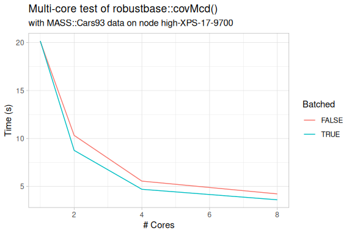
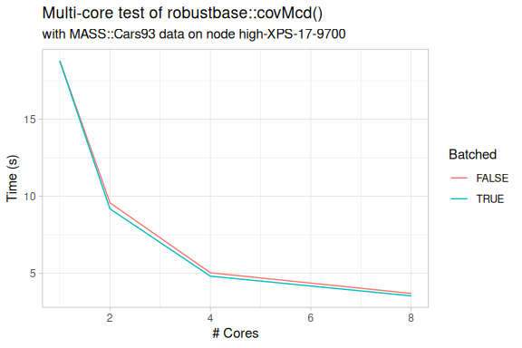
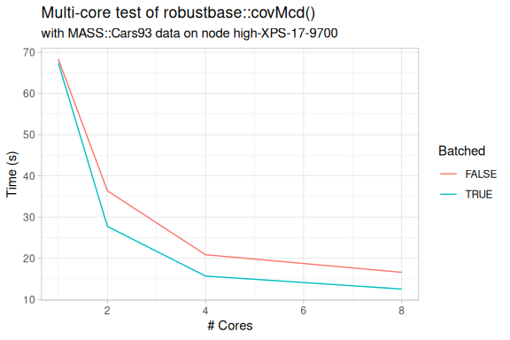

## High Performance Computing (HPC)

What if your own workstation or laptop is not powerful or fast enough to do 
your work? How would you know?

## Case Study: Geospatial Data Analysis

Working in IT support, sometimes we receive a request like this:

```
Date: Tue, 7 Jan 2025 14:40:30 -0800
Subject: Help with running time-consuming code

I am wondering if you could help me with some time consuming code. I am
calculating a variable for a raster grid of the whole United States over a
five year time period, and it is taking several hours to just run one week
of data. I have attempted setting up parallel processing on my device, but
have not been successful.
```

Where do we start?

## Know your limits

How many CPU **cores** does my computer have available? How many do I need?

How much **memory** (RAM) and **storage** ("disk" or SSD) capacity do I have 
available? 

What is the difference between these two? How much do I need?

How fast is my **network** connection? Is that fast enough?

Of these four, which could be the biggest limitation ("bottleneck")?

How do I find the answers? How can I increase these resources?

## Learning Objectives

- Know what **High Performance Computing** (HPC) means
- Know some HPC systems **available** at the UW
- Know how to **connect** to UW HPC systems and **transfer files**
- Know what a **compute cluster** is and when you would use it
- Differentiate between a **head node** and a **compute node**
- Know what **parallel processing** means and how to use it
- Know how to maximize performance through **parallel processing**.

## What is High Performance Computing (HPC)?

From Wikipedia:

"High-performance computing (HPC) uses supercomputers and computer clusters to 
solve advanced computation problems."

For our purposes, HPC systems may also include "stand-alone" servers which have 
significantly more resources than a typical workstation or laptop.

## HPC systems at the UW

As students you may obtain **free** access to:

- [SPH RStudio Server](https://rstudio.sph.washington.edu)
- [CSDE Servers](https://csde.washington.edu/computing/resources/)
- [hyak Cluster](https://hyak.uw.edu/systems)

You may also have access to additional UW clusters such as:

- SPH Clusters (Biostatistics and DEOHS)
- [Statistics Cluster](https://stat.uw.edu/news-resources/computing/resources)
- [Genome Sciences Cluster](https://www.gs.washington.edu/computing/index.htm)

## How to connect to UW HPC systems

Most HPC systems support:

- SSH for terminal-based ("shell") connections (text only interface)
- SFTP for file transfer (text and graphical interfaces)

Some HPC systems also support:

- Web-based interfaces (i.e., web apps) such as RStudio Server
- Graphical "desktop" connections with Remote Desktop (RDP) or X2Go
- "X11 forwarding" protocol which "tunnels" graphical apps through SSH

## RStudio Server (Web app)

[SPH RStudio Server](https://rstudio.sph.washington.edu):

- "Stand-alone", meaning it is not part of a cluster, but with much 
  more resources than most workstations & laptops.
- A "virtual machine", meaning that system resources can 
  be adjusted (by the administrators) to meet demand.
- Accessible by SPH students, staff, and faculty. (free)

## Hyak OnDemand

- Web [browser based access to Hyak](https://ondemand.hyak.uw.edu/)
- Delivered through [Open OnDemand](https://openondemand.org) web portal
- Offers web apps for MATLAB, Jupyter, RStudio, VS Code, desktop, and terminal
- Handles job scheduling and session management for you
- Remote access requires UW Husky OnNet (Big-IP EDGE) VPN.
- Access requires a hyak account. ([free to UW students](https://hyak.uw.edu/docs/account-creation/))

## What is a compute cluster?

A **compute cluster** is a collection of computers configured with:

- A **head node** (login node) that runs a **job scheduler**
- One or more **compute nodes**
- **Access control** to limit access to the cluster 

## When would you use compute cluster?

You will want to use a compute cluster when:

- Your work is too **resource intensive** for your other systems.
- Your work would benefit from **more cores and memory**.
- You can configure your software (code) to use more cores.
- And, especially, when you need to use **multiple nodes simultaneously**.

## What are head and compute nodes?

The **head node** (login node) is where you:

- **Connect** to the cluster
- **Configure** your software environment (e.g., install packages)
- Configure, **launch**, and manage **batch jobs**
- Launch **interactive sessions**
- Transfer data into and out of the cluster

The **compute nodes** are where you **run** your jobs and interactive sessions.

Think of Open OnDemand as a **web portal** to a login node.

## Exercise #1: Run RStudio (hyak, SPH, or local)

**A. Hyak OnDemand RStudio Server** (preferred, but offline 2nd-Tues. of month)

- Go to: https://ondemand.hyak.uw.edu & log in with UW Netid.
- Click "Interactive Apps" -> RStudio, fill out form, and press LAUNCH.

**B. SPH RStudio Server** (if you can't access hyak)

- Go to: https://rstudio.sph.washington.edu & log in with Netid.

**C. Otherwise, use RStudio on your own device (local).**

**Q1**: What R version is RStudio using? On which platform?


``` r
R.version[c('version.string', 'platform')]
```

```
##                _                           
## version.string R version 4.3.3 (2024-02-29)
## platform       x86_64-pc-linux-gnu
```

## Exercise #2: Upload and Download files using RStudio Server

**If** you were able to access hyak or SPH **RStudio Server**:

- Upload files with "Files -> Upload" in the Files pane of RStudio.
- Download files with "More -> Export..." in the Files pane of RStudio.

**Q2**: What happens if you select multiple files when using "More -> Export..."?

## Parallel processing

Parallel processing is when a system performs multiple operations simultaneously:

- to decrease run time (speed-up)
- to increase problem size (scale-up)
- to save energy (power, cooling, etc.)

Generally, you will need to utilize multiple CPU (or GPU) cores on one or 
multiple computers to achieve parallel processing. Today, we will focus on 
multi-core parallelism with CPU "cores". 

A CPU core is a processing unit within a CPU chip that can execute instructions 
independently. For example, if you have 4 cores, you can run 4 operations 
simultaneously.

## Parallel processing: the good & bad news

Good news:

- Almost every modern computer has multiple CPU cores.
- Some software applications support parallel processing.

Bad news:

- Many data analysis tools, like R, are single-core by default so you will
  likely have to modify your code for parallel support.
- Parallel performance may not scale up linearly, due to overhead.
- Some tasks are inherently serial and cannot be run in parallel, such as 
  performing a single calculation on your entire dataset.

## Exercise #3: Know your resources

**Q3**: What system resources are available? This R code will tell you:


``` r
# Attach packages, installing as needed
pacman::p_load(benchmarkme, memuse)

# A. Find operating system (OS) type (Note: "Darwin" means macOS)
benchmarkme::get_sys_details()$sys_info$sysname
```

```
## [1] "Linux"
```

``` r
# B. Find number of (virtual) CPU cores
benchmarkme::get_cpu()$no_of_cores
```

```
## [1] 12
```

``` r
# C. Find total system RAM ("Random Access Memory", i.e., "working memory")
memuse::Sys.meminfo()
```

```
## Totalram:  15.367 GiB 
## Freeram:    6.702 GiB
```

## Exercise #3: Know your resources (cont'd)

**Q3** (continued): What about available storage (HDD, SSD, etc.) space?


``` r
# Find available storage on home disk (or volume)
cmd <- list(
    unix = "df -h ~", 
    windows = paste('powershell -command', 
      "$h = $ENV:HOMEDRIVE -replace '.{1}$' 
       Get-PSDrive $h | ? { $_.Provider.Name -eq 'FileSystem' }"))
system(cmd[[.Platform$OS.type]], intern = TRUE)   # Not run for user privacy
```

```
## [1] "Filesystem                  Size  Used Avail Use% Mounted on"
## [2] "rpool/USERDATA/home_zhd6vk  437G  412G   26G  95% /home"
```

**Discussion**: Compare the amount of free memory (RAM) with available storage. 
Explain the main difference between the two kinds of "space" and what that 
means for your data processing.

## Parallel processing strategy

Once you have developed a script to perform your task, you will want to:

- Modularize: Put repeated operations into functions.
- Automate: Call your functions repeatedly using, e.g., `lapply()` or `map()`.
- For those operations which (1) can be performed independently, and (2) are 
  run many times, verify that these could be run in parallel.
- Modify your code to use functions that support parallel processing, e.g., 
  `mclapply()`, `parLapply()`, or `future_map()`.

## Parallel processing example

Load packages and create a test function to be "computationally expensive".


``` r
# Attach packages, installing as needed.
pacman::p_load(rsample, parallel, robustbase, MASS, microbenchmark, ggplot2)

# Define a function to perform a "computationally expensive" calculation.
# Ideally, it would resemble a "parallelizable" component of your data analysis.
# In this example, we are just trying to make the computer do extra work.
rc <- function(X, scale = 1, ...) { 
  df <- MASS::Cars93[, c("Price", "Horsepower", "Weight")]
  if (scale > 1) df <- df[rep(seq_len(nrow(df)), times = scale), ]
  lapply(X, function(x) robustbase::covMcd(df, cor = TRUE, ...)$cor)
}
```

## Parallel processing example (cont'd)

Define test parameters. These can be adjusted to simulate various scenarios. To
make results more comparable, set each of these to be evenly divisible by the 
number of CPU cores you plan to use. This way you can avoid "remainders".


``` r
# Set the number of "runs" (executions) of test function `rc()`.
nruns <- 800
X <- 1:nruns

# Set the number of times to duplicate the data to simulate "bigger" data.
scale <- 32

# Set the number of "trials" to use for the "nsamp" parameter of `covMcd()`.
nsamp <- 128    # If too small, multi-core "overhead" may exceed benefits.
```

## Parallel processing example (cont'd)

Execute the `rc()` function many times (just to create extra CPU load) with one 
and several CPU cores.


``` r
# Single core version using `lapply()`. Tune parameters so this takes < ~60s.
system.time(res <- lapply(X, rc, scale = scale, nsamp = nsamp))
```

```
##    user  system elapsed 
##  20.490   0.012  20.512
```

``` r
# Parallel (multi-core) version using `mclapply()` and `mc.cores = 4` (4 cores).
if (.Platform$OS.type == 'unix')  # Windows does not support mc.cores > 1
  system.time(res <- mclapply(X, rc, scale = scale, nsamp = nsamp, mc.cores = 4))
```

```
##    user  system elapsed 
##  16.123   0.354   5.531
```

``` r
# Parallel (multi-core) version using `parLapply()` and `makeCluster(4)`.
cl <- makeCluster(4)        # Use 4 cores.
system.time(res <- parLapply(cl, X, rc, scale = scale, nsamp = nsamp))
```

```
##    user  system elapsed 
##   0.003   0.001   5.280
```

``` r
stopCluster(cl)
```

## Exercise #4: Parallel processing overhead

As you scale to more CPU cores, R will need to copy itself and your data to 
each core. This involves extra overhead. Let's see this in action.

- Run the previous example and note your execution times.
- Try using different number of cores (up to 8) and compare the resulting times.

**Q4**: Do more cores improve speed linearly? If not, how would you describe it? 
Is there a "sweet spot", beyond which adding more cores is not really worth it?

## Parallel overhead test functions

First, let's make a "wrapper" function, `multicore_test()` to run `rc()` 
using `n` cores. 

We will add a few new features, such as the option to group the data into `n` 
batches and to use `microbenchmark()` so we can replicate each test run `times` 
times to get execution time averages.


``` r
# Define a function to automate a multi-core comparison test.
multicore_test <- function(n, X, batch = FALSE, times = 3, ...) { 
  if (batch & n > 1) X <- split(X, cut(X, breaks = n))
  res <- suppressWarnings(
    microbenchmark({ 
      cl <- makeCluster(n) 
      res_n <- parLapply(cl, X, rc, ...)
      stopCluster(cl) 
    }, times = times, unit = 'seconds')
  )
  return(mean(res$time)/10^9)
}
```

## Parallel overhead test functions (cont'd)

We can run the `multicore_test()` function `length(N)` times, where `N` is a 
vector of the number of cores to supply to the function as `n`. We will use a 
series of powers of two, so that we can compare the doubling and redoubling of 
the number of cores used in each test.


``` r
# Define a function to run a task with varying number of CPU cores.
run_test <- function(X, N = c(1, 2, 4, 8), ...) {
  times <- lapply(c(FALSE, TRUE), function(batch) {
    sapply(N, multicore_test, X, batch = batch, ...)
  })
  data.frame(`# Cores` = c(N, N), `Time (s)` = unlist(times), 
             Batched = rep(c(FALSE, TRUE), each = length(N)), 
             check.names = FALSE)
}
```

## Parallel overhead test functions (cont'd)

Lastly, create a function to make a plot from `run_test()` results.


``` r
# Define a function to plot `run_test()` results.
make_plot <-function(df) {
  ggplot(df, aes(`# Cores`, `Time (s)`, color = Batched)) + 
    geom_line() + theme_light() + 
    ggtitle('Multi-core test of robustbase::covMcd()', 
            subtitle = paste(c('with MASS::Cars93 data on node', 
                               Sys.info()["nodename"]), collapse = ' ')) 
}
```

## Parallel overhead and batching

Batching by number of cores may improve processing speed by reducing overhead. 
This effect may be more noticeable if resources are more limited, like on smaller 
systems like workstations (desktops) and mobile devices (laptops and tablets).


``` r
# Tune parameters so run time decreases with more cores, unbatched & batched.
make_plot(run_test(X, scale = scale, nsamp = nsamp))
```



## Batching comparison with more work

Here we repeat the previous experiment, but with more per-core processing 
("trials"), and with less data (rows). As the increase in work is performed by 
the `covMcd()` function running within each individual process, increasing it 
should not have a significant impact on parallel processing overhead. So, 
batching may not be as helpful as before.


``` r
mod_x <- 4    # Adjust the modification factor to change the scenario.
make_plot(run_test(X, scale = round(scale / mod_x), nsamp = mod_x * nsamp))
```



## Batching comparison with more data

And finally, we repeat the test with more data (more rows), but fewer "trials". 
Increasing data size increases the memory (RAM) required, which is a significant 
contributor to processing overhead. So, batching may improve performance more 
than in the previous scenario.


``` r
mod_x <- 4    # Adjust the modification factor to change the scenario.
make_plot(run_test(X, scale = scale * mod_x, nsamp = round(nsamp / mod_x)))
```


