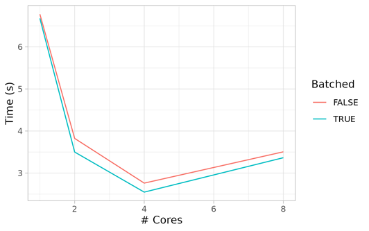

## High Performance Computing (HPC)

What if your own workstation or laptop is not powerful or fast enough to do 
your work? How would you know?

## Case Study: Geospatial Data Analysis

Working in IT support, sometimes I receive a request like this:

```
Date: Tue, 7 Jan 2025 14:40:30 -0800
Subject: Help with running time-consuming code

I am wondering if you could help me with some time consuming code. I am
calculating a variable for a raster grid of the whole United States over a
five year time period, and it is taking several hours to just run one week
of data. I have attempted setting up parallel processing on my device, but
have not been successful.
```

Where do we start?

## Know your limits

How many CPU **cores** does my computer have available? How many do I need?

How much **memory** (RAM) and **storage** ("disk" or SSD) capacity do I have 
available? 

What is the difference between these two? How much do I need?

How fast is my **network** connection? Is that fast enough?

Of these four, which could be the biggest limitation ("bottleneck")?

How do I find the answers? How can I increase these resources?

## Learning Objectives

- Know what **High Performance Computing** (HPC) means
- Know some HPC systems **available** at the UW
- Know how to **connect** to UW HPC systems and **transfer files**
- Know what a **compute cluster** is and when you would use it
- Differentiate between a **head node** and a **compute node**
- Know what **parallel processing** means and how to use it
- Know how to maximize performance through **parallel processing**.

## What is High Performance Computing (HPC)?

From Wikipedia:

"High-performance computing (HPC) uses supercomputers and computer clusters to 
solve advanced computation problems."

For our purposes, HPC systems may also include "stand-alone" servers which have 
significantly more resources than a typical workstation or laptop.

## HPC systems at the UW

As students you may obtain **free** access to:

- [SPH RStudio Server](https://rstudio.sph.washington.edu)
- [CSDE Servers](https://csde.washington.edu/computing/resources/)
- [hyak Cluster](https://hyak.uw.edu/systems)

You may also have access to additional UW clusters such as:

- SPH Clusters (Biostatistics and DEOHS)
- [Statistics Cluster](https://stat.uw.edu/news-resources/computing/resources)
- [Genome Sciences Cluster](https://www.gs.washington.edu/computing/index.htm)

## How to connect to UW HPC systems

Most HPC systems support:

- SSH for terminal-based ("shell") connections (text only interface)
- SFTP for file transfer (text and graphical interfaces)

Some HPC systems also support:

- Web-based interfaces (i.e., web apps) such as RStudio Server
- Graphical "desktop" connections with Remote Desktop (RDP) or X2Go
- "X11 forwarding" protocol which "tunnels" graphical apps through SSH

## RStudio Server (Web app)

[SPH RStudio Server](https://rstudio.sph.washington.edu):

- "Stand-alone", meaning it is not part of a cluster, but with much 
  more resources than most workstations & laptops.
- A "virtual machine", meaning that system resources can 
  be adjusted (by the administrators) to meet demand.
- Accessible by SPH students, staff, and faculty. (free)

## Hyak OnDemand

- Web [browser based access to Hyak](https://ondemand.hyak.uw.edu/)
- Delivered through [Open OnDemand](https://openondemand.org) web portal
- Offers web apps for MATLAB, Jupyter, RStudio, VS Code, desktop, and terminal
- Handles job scheduling and session management for you
- Remote access requires UW Husky OnNet (Big-IP EDGE) VPN.
- Access requires a hyak account. ([free to UW students](https://hyak.uw.edu/docs/account-creation/))

## What is a compute cluster?

A **compute cluster** is a collection of computers configured with:

- A **head node** that runs a **job scheduler**
- One or more **compute nodes**
- **Access control** to limit access to the cluster 

## When would you use compute cluster?

You will want to use a compute cluster when:

- Your work is too **resource intensive** for your other systems.
- Your work would benefit from **more cores and memory**.
- You can configure your software (code) to use more cores.
- And, especially, when you need to use **multiple nodes simultaneously**.

## What are head and compute nodes?

The **head node** is where you:

- **Connect** to the cluster
- **Configure** your software environment (e.g., install packages)
- Configure, **launch**, and manage **batch jobs**
- Launch **interactive sessions**
- Transfer data into and out of the cluster

The **compute nodes** are where you **run** your jobs and interactive sessions.

## Exercise #1: Run RStudio (hyak, SPH, or local)

**A. Hyak OnDemand RStudio Server** (preferred)

- Go to: https://ondemand.hyak.uw.edu & log in with UW Netid.
- Click "Interactive Apps" -> RStudio, fill out form, and press LAUNCH.

**B. SPH RStudio Server** (if you can't access hyak)

- Go to: https://rstudio.sph.washington.edu & log in with Netid.

**C. Otherwise, use RStudio on your own device (local).**

**Q1**: What R version is RStudio using? On which platform?


``` r
R.version[c('version.string', 'platform')]
```

## Exercise #2: Upload and Download files using RStudio Server

**If** you were able to access hyak or SPH **RStudio Server**:

- Upload files with "Files -> Upload" in the Files pane of RStudio.
- Download files with "More -> Export..." in the Files pane of RStudio.

**Q2**: What happens if you select multiple files when using "More -> Export..."?

## Parallel processing

Parallel processing is when a system performs multiple operations simultaneously.

There are four main types of parallelism in computing:

- Process-based (multiple computers with message passing)
- Thread-based (multiple cores with shared memory)
- Vectorization (multiple calculations per core)
- Stream processing (utilize special processors like GPUs)

## Process and thread-based parallelism

In practical terms, parallel processing means your application or code can 
utilize more than one CPU (or GPU) "core", on one or more computers, at the 
same time.

Many CPUs are "hyper-threaded", meaning that every physical CPU core will be 
offer two virtual cores. This means an 8-core hyper-threaded CPU offers 16 
vCPU cores. (R sees these vCPUs as if they were physical CPU cores.)

For example, R will only use one CPU core by default, but you can write 
your R scripts to use multiple cores with special packages and functions.

## When to use parallel processing?

- When you want to decrease run time (speed-up)
- When you want to increase problem size (scale-up)
- When you want to save energy (power, cooling, etc.)

## Parallel processing: the good & bad news

Good news:

- Almost every modern computer has multiple CPU cores.
- Some utility programs support parallel processing.

Bad news:

- Many data analysis apps and languages, like R, are single-core by default.
- You will likely have to modify your code or workflow for parallel support.

## Exercise #3: Know your resources

**Q3**: What system resources are available? This R code will tell you:


``` r
# Attach packages, installing as needed
pacman::p_load(benchmarkme, memuse)

# A. Find operating system (OS) type (Note: "Darwin" means macOS)
benchmarkme::get_sys_details()$sys_info$sysname

# B. Find number of (virtual) CPU cores
benchmarkme::get_cpu()$no_of_cores

# C. Find total system RAM ("Random Access Memory", i.e., "working memory")
memuse::Sys.meminfo()
```

## Exercise #3: Know your resources (continued)


``` r
# Find storage usage for home disk (or volume)
cmd <- list(
    unix = "df -h ~", 
    windows = paste('powershell -command', 
      "$h = $ENV:HOMEDRIVE -replace '.{1}$' 
       Get-PSDrive $h | ? { $_.Provider.Name -eq 'FileSystem' }"))
system(cmd[[.Platform$OS.type]])
```

**Discussion**: Compare the amount of free memory (RAM) with available storage. 
Explain the main difference between the two kinds of "space" and what that 
means for your data processing.

## Parallel processing strategy

Once you have developed a script to perform your task, you will want to:

- Modularize: Put repeated operations into functions.
- Automate: Call your functions repeatedly using, e.g., `lapply()` or `map()`.
- For those operations which (1) can be performed independently, and (2) are 
  run many times, verify that these could be run in parallel.
- Modify your code to use functions that support parallel processing, e.g., 
  `mclapply()`, `parLapply()`, or `future_map()`.

## Parallel processing example

Given this function:


``` r
# Attach packages, installing as needed
pacman::p_load(parallel, robustbase, MASS, here, tibble, ggplot2)

# Calculate robust covariance
rc <- function(x) {
  data(Cars93, package = "MASS")
  n <- nrow(Cars93)
  sapply(x, function(x) {  # Repeat for every x, just to create extra work
    robustbase::covMcd(Cars93[sample(1:n, replace=TRUE), 
                  c("Price", "Horsepower")], cor = TRUE)$cor[1,2]
  })
}
```

## Parallel processing example

Execute the above function many times (just to create extra CPU load) with one 
and several CPU cores.


``` r
# Single core version using `lappy()`
system.time(result_single <- lapply(1:800, rc))

# Parallel (multicore) version using `mclapply()` and `mc.cores = 4`
system.time(result_multi <- mclapply(1:800, rc, mc.cores = 4))
## NOTE: Windows does not support mclapply() with mc.cores > 1 (multicore).

# Parallel (multicore) version using `parLapply()` and `makeCluster(4)`
cl <- makeCluster(4) 
system.time(result_multi <- parLapply(cl, 1:800, rc))
stopCluster(cl)
# This may be faster or slower than mclapply(), depending on your situation.
```

## Exercise #4: Parallel processing overhead

As you scale to more CPU cores, R will need to copy itself and your data to 
each core. This involves extra overhead. Let's see this in action.

- Run the previous example in RStudio and note your execution times.
- Try using different number of cores (up to 8) and compare the resulting times.

**Q4**: Do more cores improve speed linearly? If not, how would you describe it? 
Is there a "sweet spot", beyond which adding more cores is not really worth it?

## Exercise #4: Parallel processing (hint)


``` r
# Time the running of a task with varying number of CPU cores, then plot.
# Use parLapply() instead of mclapply() to support Windows.
fun <- function(n, .data = 1:800, batch = FALSE) { 
  if (batch & n > 1) .data <- split(.data, cut(.data, breaks = n))
  system.time({ cl <- makeCluster(n) 
                system.time(res_n <- parLapply(cl, .data, rc))
                stopCluster(cl) })[['elapsed']]
}
N <- c(1, 2, 4, 8)
T1 <- sapply(N, fun, batch = FALSE)
T2 <- sapply(N, fun, batch = TRUE)
df <- tibble(`# Cores` = c(N, N), `Time (s)` = c(T1, T2), 
             Batched = rep(c(F, T), each = length(N)))
ggplot(df, aes(`# Cores`, `Time (s)`, color = Batched)) + 
       geom_line() + theme_light()
```

## Exercise #4: Parallel processing (results)

Your results to look something like this: 



Tip: For your own projects, do a test like this with a small subset of your 
data to find the "sweet spot". Here, that spot is 4 cores.
